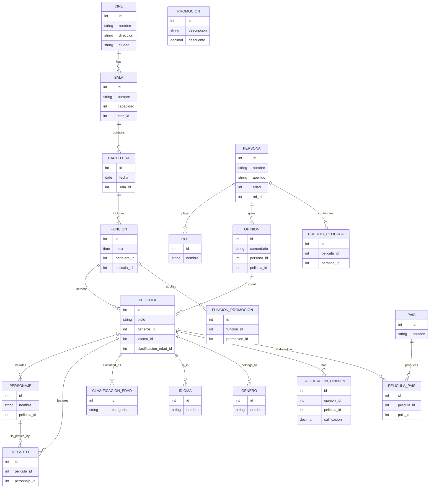

```mermaid
erDiagram
    CINE {
        int id
        string nombre
        string direccion
        string ciudad
    }
    SALA {
        int id
        string nombre
        int capacidad
        int cine_id
    }
    CARTELERA {
        int id
        date fecha
        int sala_id
    }
    FUNCION {
        int id
        time hora
        int cartelera_id
        int pelicula_id
    }
    PROMOCION {
        int id
        string descripcion
        decimal descuento
    }
    FUNCION_PROMOCION {
        int id
        int funcion_id
        int promocion_id
    }
    PELICULA {
        int id
        string titulo
        int generos_id
        int idioma_id
        int clasificacion_edad_id
    }
    GENERO {
        int id
        string nombre
    }
    IDIOMA {
        int id
        string nombre
    }
    CLASIFICACION_EDAD {
        int id
        string categoria
    }
    PAIS {
        int id
        string nombre
    }
    PELICULA_PAIS {
        int id
        int pelicula_id
        int pais_id
    }
    PERSONA {
        int id
        string nombre
        string apellido
        int edad
        int rol_id
    }
    ROL {
        int id
        string nombre
    }
    CREDITO_PELICULA {
        int id
        int pelicula_id
        int persona_id
    }
    PERSONAJE {
        int id
        string nombre
        int pelicula_id
    }
    REPARTO {
        int id
        int pelicula_id
        int personaje_id
    }
    CALIFICACION_OPINION {
        int id
        int opinion_id
        int pelicula_id
        decimal calificacion
    }
    OPINION {
        int id
        string comentario
        int persona_id
        int pelicula_id
    }

    CINE ||--o{ SALA : has
    SALA ||--o{ CARTELERA : contains
    CARTELERA ||--o{ FUNCION : includes
    FUNCION ||--o{ FUNCION_PROMOCION : applies
    FUNCION ||--o{ PELICULA : screens
    PELICULA ||--o{ PELICULA_PAIS : produced_in
    PELICULA ||--o{ CALIFICACION_OPINION : has
    PERSONA ||--o{ CREDITO_PELICULA : contributes
    PERSONA ||--o{ OPINION : gives
    OPINION ||--o{ PELICULA : about
    PELICULA ||--o{ GENERO : belongs_to
    PELICULA ||--o{ IDIOMA : is_in
    PELICULA ||--o{ CLASIFICACION_EDAD : classified_as
    PELICULA ||--o{ REPARTO : features
    PELICULA ||--o{ PERSONAJE : includes
    PERSONA ||--o{ ROL : plays
    PERSONAJE ||--o{ REPARTO : is_played_by
    PAIS ||--o{ PELICULA_PAIS : produces
```
